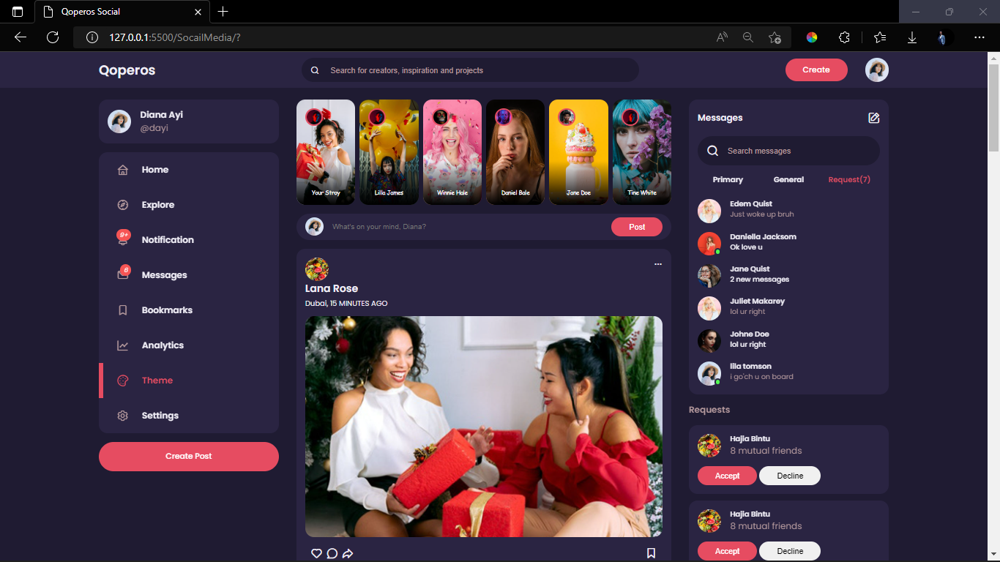
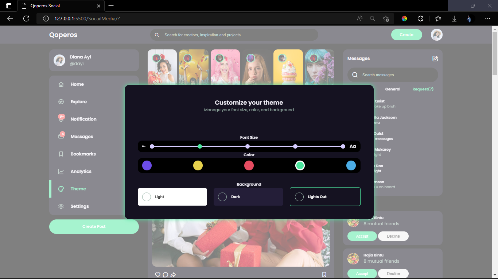
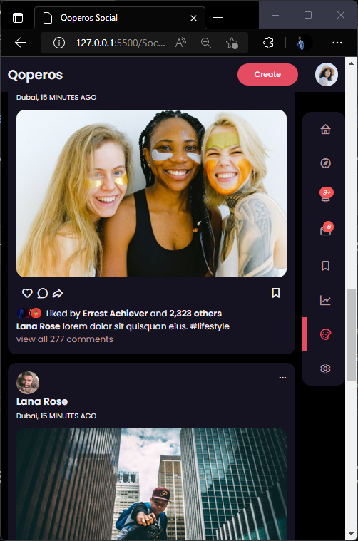
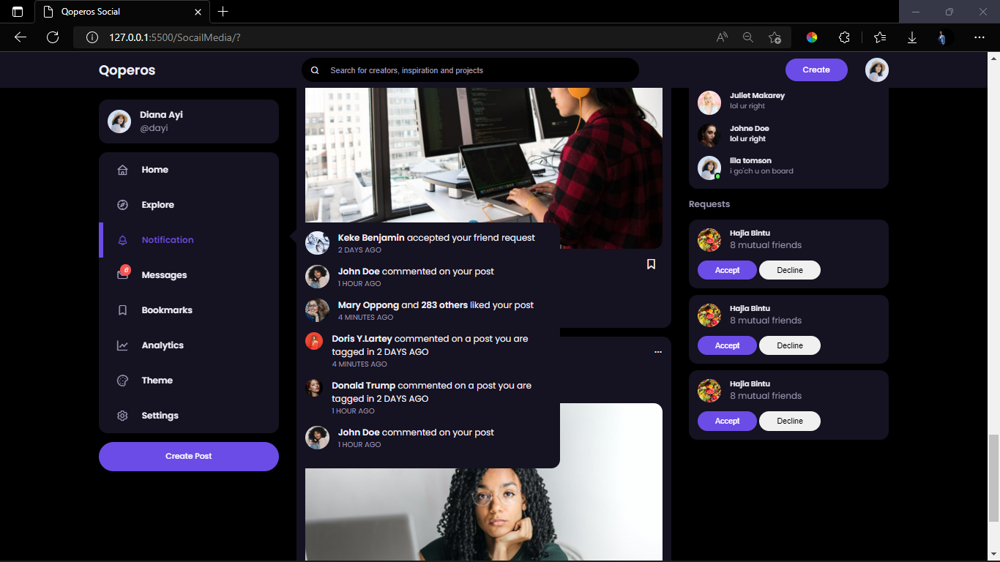

# Demo of social media platform using HTML CSS AND JAVASCRIPT!

> This is a sample show case of a social media website like facebook using html css and javascript.  
> It's a responsive design using css media queries

> # Have a theme setting for different :
>
> - Font sizes
> - Colors and
> - Background themes

> Responsive design

---------------------------------------------------------------

> # Notification and Message Searching Features
>
> - Have notification popup feature
> - It search messages by user name

